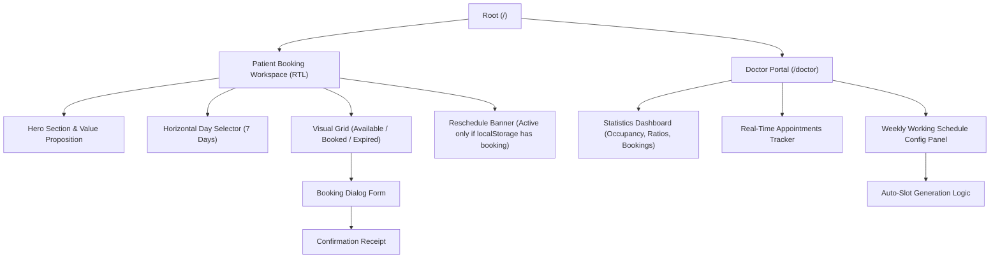
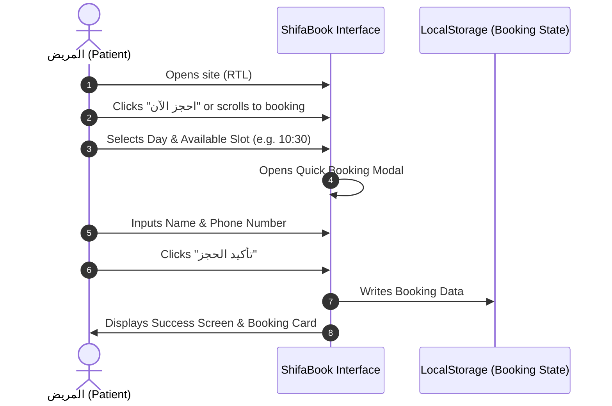
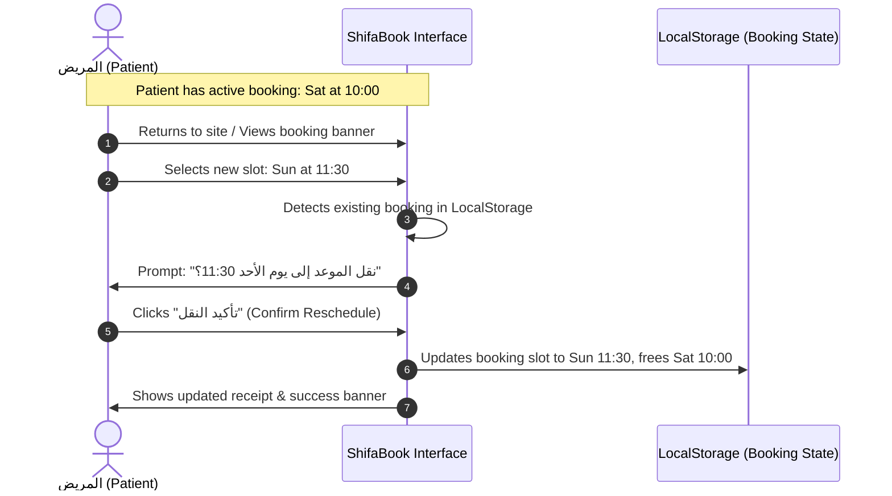
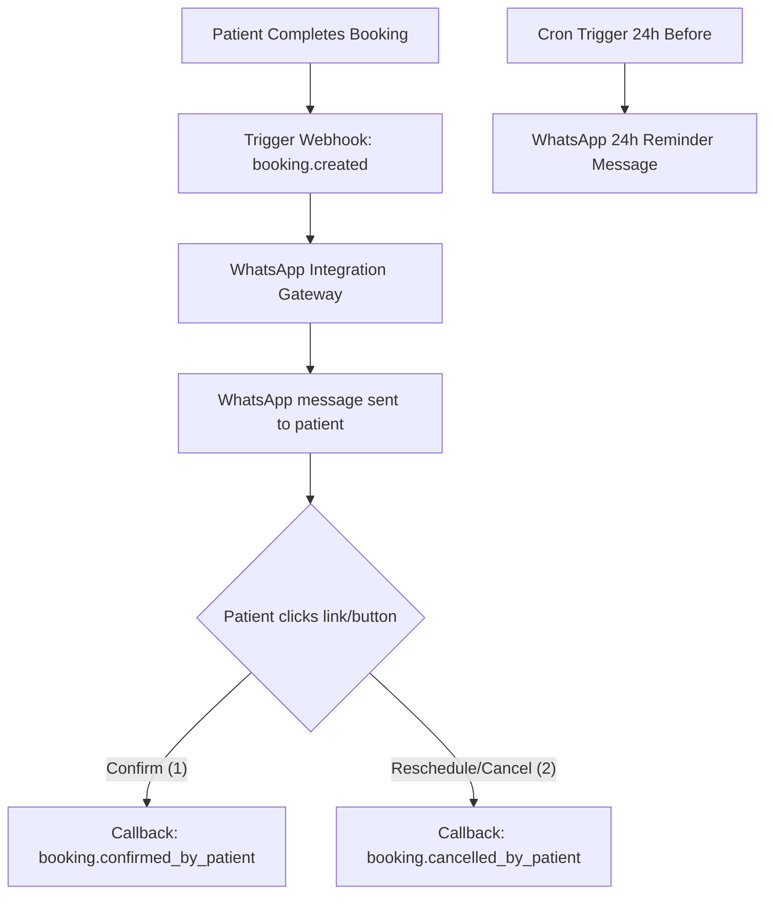

# Product Requirements Document (PRD) & System Architecture

## Project: ShifaBook (شفاء بوك) — Arabic-First Clinic Booking System MVP
**Author**: Senior Product Engineer & SaaS UX Architect  
**Status**: Proposal / Architectural Stage  

---

## 1. Product Overview & Vision
Traditional clinic booking systems are plagued by friction: multi-step account registration, lengthy medical intake forms, and confusing calendar lists. **ShifaBook** is an Arabic-first Clinic Booking MVP designed to solve this by optimizing for high conversion, speed, and simplicity. 

Inspired by **airline seat selection**, patients can book their appointment in **less than 30 seconds**. The visual booking grid provides instant clarity on available, booked, and expired slots. 

### Core KPIs
- **Time-to-Book**: < 30 seconds.
- **Conversion Rate**: Maximum ratio of page visits to completed bookings.
- **Friction Index**: Zero logins, zero passwords, zero unnecessary fields.

---

## 2. User Roles & Core Requirements

### 2.1 The Patient (المريض)
* **Goal**: Book an appointment with zero friction.
* **Flow**:
  1. Open page (RTL default, premium visual brand).
  2. Click **"احجز الآن" (Book Now)** to jump to the visual grid.
  3. Choose preferred day & time slot.
  4. Input only: **Full Name (الاسم الكامل)** and **Mobile Number (رقم الجوال)**.
  5. Click **"تأكيد الحجز" (Confirm Booking)** -> Instantly see confirmation.
* **Constraints**: No logins, no passwords, no email required, local state and cookie/localStorage tracking for instant recovery/rescheduling.

### 2.2 The Doctor / Clinic Owner (الطبيب / صاحب العيادة)
* **Goal**: Monitor occupancy rates and manage clinic availability efficiently.
* **Flow**:
  1. Access dashboard at `/doctor`.
  2. View real-time statistics (Occupancy rate, booked vs. available slots, list of upcoming patients).
  3. Configure the weekly working schedule using a simple interface (working days, start time, end time, slots per day).
  4. System automatically regenerates the patient-facing booking grid.

---

## 3. Core MVP Features

### F1: Arabic-First & High-End RTL Styling
* RTL layout by default (`dir="rtl"` in HTML/body).
* English transition support via standard language switcher.
* Curated premium visual style: Emerald green, calm teals, soft warm accents, clean professional Arabic typography (e.g., Cairo or Tajawal).

### F2: Visual Booking Grid (Seat-Selection Feel)
* Interactive calendar selector (quick day carousel).
* Dynamic visual grid representing slots:
  * **Available (متاح)**: Premium teal/emerald interactive borders, hover glow, clickable.
  * **Booked (محجوز)**: Elegant faded gray, disabled, displays "محجوز".
  * **Expired (منتهي)**: Subtly crossed out or faded, indicating slots in the past.

### F3: One-Click Booking Flow
* Clicking an available slot opens an elegant RTL Modal dialog.
* Collects name and phone number with built-in active validation.
* Immediate success state with dynamic receipt detail.

### F4: Rescheduling Logic (Preventing Duplicates)
* System tracks active booking via `localStorage`.
* If a patient attempts to book a new slot while holding an active booking:
  * System alerts the patient: **"لديك موعد محجوز بالفعل. هل ترغب في نقله إلى هذا الوقت الجديد؟"**
  * Confirming updates the booking slot and frees up the old slot instantly in local memory.

### F5: Doctor Dashboard & Auto-Slot Generator
* Interactive dashboard at `/doctor` showing:
  * **Occupancy Rate**: Visual circular chart or premium progress indicator.
  * **Today's Bookings Count**, **Remaining Slots**, and **Upcoming Patient List**.
* **Weekly Schedule Builder**:
  * Inputs: Working days (checkboxes), Start Hour (e.g. 09:00), End Hour (e.g. 17:00), Appointments per Day (e.g. 20 slots).
  * System calculates slot duration automatically and creates the grid.

---

## 4. Information Architecture (IA)



---

## 5. Component Architecture

The codebase will follow a clean component-driven structure:

### 5.1 Shared Components
* **`Navbar.tsx`**: Header with logo, clinics logo, language switcher (العربية/English), and quick link to `/doctor`.
* **`Footer.tsx`**: High-end healthcare branding, trust badges, operating hours.

### 5.2 Patient Booking Components (`src/components/booking`)
* **`HeroSection.tsx`**: Calm, premium hero banner. Large CTA leading directly to the Booking Section.
* **`DaySelector.tsx`**: Horizontal, swipeable scroll container showing days of the week (e.g., "السبت 1 يونيو"). Indicates which days are active working days.
* **`BookingGrid.tsx`**: Grid of dynamic time slots (styled like an airline seat map). Segregates morning, afternoon, and evening slots for readability.
* **`BookingModal.tsx`**: Arabic-first dialog capturing Name, Mobile, and presenting a clear "تأكيد الحجز" button.
* **`RescheduleBanner.tsx`**: Shows at the top of the booking panel if patient already has a booking, giving them instructions on how to drag-drop or click to move it.

### 5.3 Doctor Dashboard Components (`src/components/doctor`)
* **`StatsDashboard.tsx`**: Premium analytical widgets (Occupancy %, total booked, available, and remaining).
* **`ScheduleBuilder.tsx`**: Configuration panel for doctor schedules (days active, start/end hours, slot limits) with a live generation preview.
* **`AppointmentsTracker.tsx`**: Interactive data list of patients with filters and options to "Cancel" or "Mark as Attended".

---

## 6. Screen Map

1. **Patient Landing Screen (`src/app/page.tsx`)**
   * [Header] -> Branding, Language Toggle.
   * [Hero Section] -> Title: "حجز موعدك أصبح أسهل من أي وقت", Subtitle: "اختر وقتك، أدخل اسمك، وموعدك مؤكد في 30 ثانية فقط.", CTA: "احجز الآن".
   * [Rescheduling Alert Banner] -> *Conditional* (Shows only if active booking cookie exists).
   * [Booking Portal Section] -> Calendar Selector + Visual Time Grid.
   * [Booking Modal Overlay] -> Simple form asking for Name + Phone.
   * [Success Feedback Modal] -> Summary of booking + Add to calendar option + "تعديل / نقل الموعد" option.

2. **Doctor Portal Screen (`src/app/doctor/page.tsx`)**
   * [Dashboard Header] -> Quick analytics & Occupancy indicator.
   * [Active Schedule Info] -> Current operating hours representation.
   * [Appointments Data Grid] -> Chronological list of today's booked patients.
   * [Schedule Configuration Drawer/Panel] -> Working days select, slot duration calculators, update CTA.

---

## 7. User Flows

### 7.1 Patient Quick Booking Flow (<30 seconds)


### 7.2 Patient Rescheduling Flow


---

## 8. Data Models (TypeScript Definitions)

```typescript
export interface PatientBooking {
  id: string;
  patientName: string;
  mobileNumber: string;
  date: string;       // Format: YYYY-MM-DD
  timeSlot: string;   // Format: HH:MM
  status: 'pending' | 'confirmed' | 'cancelled';
  createdAt: string;
}

export interface ScheduleConfig {
  workingDays: number[];   // Array of day index (0 for Sunday, 6 for Saturday)
  startTime: string;      // "HH:MM" e.g., "09:00"
  endTime: string;        // "HH:MM" e.g., "17:00"
  appointmentsPerDay: number; // e.g., 20 slots
}

export interface TimeSlot {
  time: string;           // "HH:MM"
  isBooked: boolean;
  isExpired: boolean;
  booking?: PatientBooking;
}
```

---

## 9. WhatsApp-Ready Architecture

To support scaling into automated notifications, ShifaBook will integrate a callback-and-cron pipeline.



### Flow and Integration Details
1. **Webhook Payload (`booking.created`)**:
   Upon booking, an API payload will be sent to our notification microservice containing:
   ```json
   {
     "event": "booking.created",
     "bookingId": "shifa_98234",
     "patientName": "أحمد العتيبي",
     "mobile": "+966500000000",
     "date": "2026-06-05",
     "time": "10:30"
   }
   ```
2. **Interactive Reply Triggers**:
   * **Message Template**: 
     `مرحباً أحمد العتيبي، تم حجز موعدك بنجاح في عيادتنا يوم 2026-06-05 الساعة 10:30. الرجاء تأكيد حضورك بالضغط على الرابط أدناه أو الرد بـ "نعم".`
   * **State Transitions**:
     * Patient replies "نعم" (Yes) -> Webhook changes state to `confirmed`.
     * Patient replies "إلغاء" (Cancel) -> Webhook frees up the slot.
